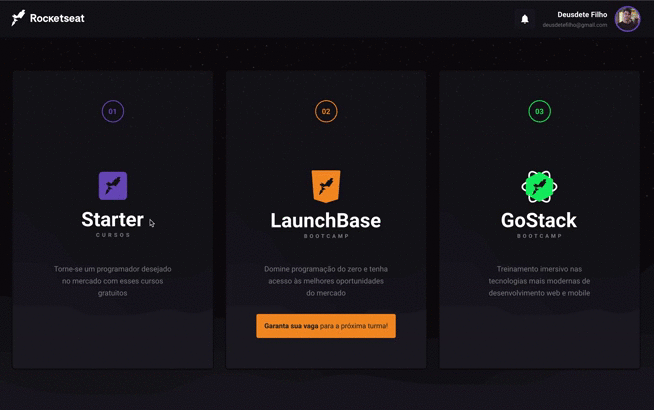

Skaylab Clone

  <a href="#page_with_curl-sobre">Sobre</a>&nbsp;&nbsp;&nbsp;|&nbsp;&nbsp;&nbsp;
  <a href="#books-requisitos">Requisitos</a>&nbsp;&nbsp;&nbsp;|&nbsp;&nbsp;&nbsp;
  <a href="#rocket-começando">Começando</a>&nbsp;&nbsp;&nbsp;|&nbsp;&nbsp;&nbsp;
  <a href="#gear-iniciando-front-end">ReactJS</a>
</>

  
   
   

## :page_with_curl: Sobre

Este repositório contém uma aplicação em ReactJS utilizando TypeScript.

Essa é a aplicação clone do Skylab, a plataforma de aulas da [Rocketseat](https://rocketseat.com.br/). Fiz o clone de apenas algumas telas da plataforma, como o listagem de cursos, listagem de aulas do curso Starter, dashboard do curso GoStack e a listagem de aulas do curso GoStack.

Nesse projeto tive o objetivo de aprimorar minhas habilidades em construção de interfaces e layouts responsivos ultilizando a biblioteca styled-components. Outra biblioteca muito utilizada foi a Skeleton, para efeitos de carregamento enquanto uma requisição a API fake é feita.

## :hammer: Tecnologias

Esse projeto foi desenvolvido com as seguintes tecnologias:

- [ReactJS](https://reactjs.org/)
- [TypeScript](https://www.typescriptlang.org/)
- [React Router Dom](https://reacttraining.com/react-router/web/guides/quick-start)
- [Axios](https://github.com/axios/axios)
- [Styled Components](https://styled-components.com/)
- [JSON Server](https://github.com/typicode/json-server)
- [React Icons](https://www.npmjs.com/package/react-icons)
- [Skeleton Loading](https://www.npmjs.com/package/react-loading-skeleton)
- [Polished](https://www.npmjs.com/package/polished)

Feito com ❤️ por Deusdete Filho👋🏻
